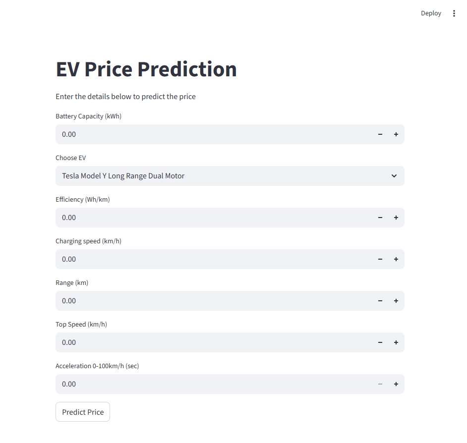

# EV Car Price Prediction(Visit: https://evpricepredict.streamlit.app)

A beginner-friendly machine learning project that predicts the price of Electric Vehicles (EVs).

The project is trained using **RandomForestRegressor** and includes a simple **Streamlit frontend** where users can enter EV details to get price predictions.

## Tech Stack

- **Python**
- **Pandas, NumPy**
- **Scikit-learn**
- **Streamlit**

## Model Metrics

- **mean_absolute_error: 6719.062580645162**
- **mean_square_error: 113437589.23394836**
- **r2_score 0.8810625358851204**

